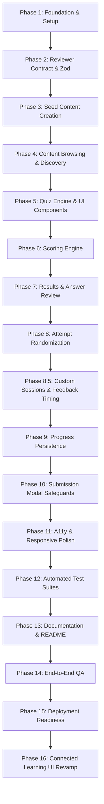

# Technical Implementation Plan: Centralized Academic Reviewer

## 1. Executive Summary & Architectural Overview

The **Centralized Academic Reviewer** is an interactive, content-driven web application designed for students to browse reviewers by academic year level and subject, take interactive quizzes, receive immediate deterministic scoring, and review question explanations.

### 1.1 Core Architectural Principles

1. **Strict Separation of Concerns**:
   - **Content Generation** (External): Academic PDFs are processed by an external Question Bank Generator to produce standardized JSON files. No PDF processing, AI generation, or external API lookups exist within the web application.
   - **Content Delivery & Scoring** (This Application): Loads, validates, discovers, renders, and deterministically scores reviewer JSON files.
2. **Content-Driven Dynamic Discovery**:
   - No hardcoded subjects, year levels, reviewers, or questions in UI components.
   - Adding a reviewer requires only dropping a valid JSON file into `/reviewers/{year-level}/{subject-code}/`.
   - The application automatically derives navigation hierarchies, search indexes, and reviewer pages from filesystem discovery and metadata parsing.
3. **Deterministic Scoring**:
   - Scoring is 100% rule-based and reproducible.
   - Zero generative AI, fuzzy semantics, or external lookups in scoring.
   - String normalization for fill-in-the-blank questions follows strict whitespace trimming and case insensitivity against explicit `acceptedAnswers`.
4. **Resilient Local Quiz State**:
   - Browser `localStorage` maintains active quiz attempts.
   - Randomization of questions and choices is locked at attempt creation and persisted to prevent reshuffling on page reload, navigation, or re-renders.
   - Unfinished attempts can be resumed or restarted cleanly.

---

## 2. Technology Stack & Directory Structure

### 2.1 Technology Stack

| Layer | Technology | Rationale |
| :--- | :--- | :--- |
| **Framework** | Next.js (App Router) | Optimal for server-side filesystem discovery, static generation, SEO, and fast client navigation. |
| **UI Library** | React 19 / TypeScript 5 (Strict) | Component modularity, type safety for complex quiz state, and zero `any` tolerance. |
| **Styling** | Tailwind CSS | Modern utility-first styling with high visual polish, dark/light contrast, responsive layouts, and accessible focus states. |
| **Validation** | Zod (v3) | Schema validation ensuring strict public contract enforcement for all external JSON files. |
| **Icons** | Lucide React | Lightweight, accessible, consistent iconography for status indicators (✓ / ✗), controls, and academic subjects. |
| **State & Persistence**| React Hooks + `localStorage` | Client-side quiz state machine with automated serialization, error handling, and versioning. |
| **Testing** | Vitest / React Testing Library | Fast unit and component test suite verifying pure scoring functions, schema validation, and persistence. |

### 2.2 Proposed Repository Structure

```text
acm_reviewer_artifacts/
├── reviewers/                        # External content directory (authoritative)
│   ├── year-1/
│   │   └── IT0123/
│   │       ├── midterm.json
│   │       └── module-1.json
│   ├── year-2/
│   ├── year-3/
│   └── year-4/
├── public/                           # Static assets, branding, favicons
├── src/
│   ├── app/                          # Next.js App Router pages
│   │   ├── layout.tsx                # Global shell, navigation bar, footer
│   │   ├── page.tsx                  # Home landing page with search & year-level cards
│   │   ├── year/[yearLevel]/
│   │   │   └── page.tsx              # Subjects list for specific year
│   │   ├── subject/[code]/
│   │   │   └── page.tsx              # Reviewers list for specific subject
│   │   ├── reviewer/[id]/
│   │   │   ├── page.tsx              # Reviewer overview & metadata, start/resume prompt
│   │   │   └── quiz/
│   │   │       └── page.tsx          # Interactive quiz session & answer review
│   │   └── not-found.tsx             # 404 handler for invalid routes or IDs
│   ├── components/                   # Reusable UI components
│   │   ├── layout/                   # Navbar, Footer, Breadcrumbs, Container
│   │   ├── ui/                       # Button, Badge, Modal, Card, Input, Progress
│   │   ├── search/                   # SearchBar, SearchResultsModal/Drawer
│   │   └── common/                   # EmptyState, ErrorBoundary, StatusIndicator
│   ├── quiz/                         # Quiz Engine core abstractions
│   │   ├── components/
│   │   │   ├── QuizEngine.tsx        # Main quiz controller (orchestrates progress & modal)
│   │   │   ├── QuestionRenderer.tsx  # Polymorphic dispatcher to specific question types
│   │   │   ├── MultipleChoice.tsx    # Single-answer radio card options
│   │   │   ├── MultipleAnswer.tsx    # Multi-answer checkbox card options
│   │   │   ├── TrueFalse.tsx         # Binary True/False toggle controls
│   │   │   ├── FillBlank.tsx         # Text input with clear instructions
│   │   │   ├── QuestionNav.tsx       # Prev/Next, question index palette, submit trigger
│   │   │   ├── SubmitModal.tsx       # Unanswered warning modal confirmation
│   │   │   └── AnswerReview.tsx      # Post-quiz review with correctness filters
│   │   ├── hooks/
│   │   │   ├── useQuizSession.ts     # Hook managing attempt lifecycle, shuffling, and storage
│   │   │   └── useQuizStorage.ts     # Safe wrapper around localStorage with fallback
│   │   └── types.ts                  # Attempt, AnswerState, and Session types
│   ├── schemas/                      # Zod validation schemas
│   │   └── reviewerSchema.ts         # Schema version 1 definitions and strict validators
│   ├── types/                        # TypeScript definitions derived from Zod schemas
│   │   └── reviewer.ts               # Reviewer, Subject, Question, Source types
│   ├── lib/                          # Core backend/data utilities
│   │   ├── content/
│   │   │   ├── reviewerLoader.ts     # Filesystem scanner and JSON parser
│   │   │   └── catalog.ts            # Indexing, grouping by year/subject, search index
│   │   └── scoring/
│   │       ├── engine.ts             # Pure deterministic evaluation functions
│   │       └── normalizer.ts         # Whitespace and case normalization for fill-blank
│   └── tests/                        # Automated test suites
│       ├── scoring.test.ts           # Scoring rule tests
│       ├── validation.test.ts        # Zod schema & error reporting tests
│       └── normalizer.test.ts        # Normalization edge case tests
├── AGENTS.md
├── SPEC.md
├── IMPLEMENTATION_PLAN.md
├── TASKS.md
├── README.md
├── package.json
├── tsconfig.json
├── tailwind.config.ts
└── vitest.config.ts
```

---

## 3. Data Contract & Schema Architecture

### 3.1 Reviewer JSON Contract (Schema Version 1)

The reviewer JSON schema represents the contract between this website and the Question Bank Generator.

```typescript
// Core TypeScript Entities (src/types/reviewer.ts)

export type QuestionType =
  | 'multiple-choice'
  | 'multiple-answer'
  | 'true-false'
  | 'fill-blank';

export interface QuestionSource {
  module: string;
  page?: number | string;
}

export interface BaseQuestion {
  id: string;
  type: QuestionType;
  topic: string;
  question: string;
  explanation: string;
  source: QuestionSource;
}

export interface MultipleChoiceQuestion extends BaseQuestion {
  type: 'multiple-choice';
  choices: string[];
  correctAnswer: string;
}

export interface MultipleAnswerQuestion extends BaseQuestion {
  type: 'multiple-answer';
  choices: string[];
  correctAnswers: string[];
}

export interface TrueFalseQuestion extends BaseQuestion {
  type: 'true-false';
  correctAnswer: boolean;
}

export interface FillBlankQuestion extends BaseQuestion {
  type: 'fill-blank';
  acceptedAnswers: string[];
}

export type Question =
  | MultipleChoiceQuestion
  | MultipleAnswerQuestion
  | TrueFalseQuestion
  | FillBlankQuestion;

export interface SubjectMetadata {
  code: string;
  name: string;
  yearLevel: number;
}

export interface ReviewerMetadata {
  title: string;
  description: string;
  coverage: string[];
  shuffleQuestions: boolean;
  shuffleChoices: boolean;
}

export interface ReviewerData {
  schemaVersion: 1;
  id: string;
  subject: SubjectMetadata;
  reviewer: ReviewerMetadata;
  questions: Question[];
}
```

### 3.2 Zod Validation Implementation & Error Formatting

Validation occurs in `src/schemas/reviewerSchema.ts`:
- **Schema Version Guard**: Enforces `schemaVersion === 1`.
- **Question ID Uniqueness**: Uses `.superRefine()` on `questions` array to detect duplicates.
- **Answer Consistency**:
  - `multiple-choice`: Verifies `choices.includes(correctAnswer)`.
  - `multiple-answer`: Verifies every item in `correctAnswers` exists within `choices` and `correctAnswers.length > 0`.
  - `fill-blank`: Verifies `acceptedAnswers.length > 0` and entries are non-empty after trimming.
- **Empty Bank Rejection**: `questions.length > 0` required.
- **Human-Readable Error Formatting**:
  Formats Zod issues into structured diagnostic strings:
  `[File: {filename}] Question "{questionId}": {issueDescription}`.

---

## 4. Content Discovery & Data Pipeline

### 4.1 Discovery Engine (`src/lib/content/reviewerLoader.ts`)

- **Filesystem Traversal**: Recursively scans the `/reviewers` directory for `.json` files at build time / request time via Node `fs` API.
- **Validation Pipeline**:
  1. Read JSON file.
  2. Parse with Zod schema.
  3. If invalid, log descriptive error and fail build (or gracefully surface error in dev mode).
  4. If valid, register in memory catalog.
- **Catalog Derivations (`src/lib/content/catalog.ts`)**:
  - `getAllReviewers()`: Returns all valid reviewers.
  - `getYearLevels()`: Derives available year levels sorted numerically (e.g., Year 1, 2, 3, 4) with reviewer counts.
  - `getSubjectsByYear(yearLevel)`: Groups subjects by code and calculates reviewer counts.
  - `getReviewersBySubject(subjectCode)`: Returns list of reviewers for a subject.
  - `getReviewerById(reviewerId)`: Fast lookup for quiz session initialization.
  - `searchReviewers(query)`: In-memory tokenized search across subject codes, subject names, reviewer titles, coverage terms, and question topics.

---

## 5. Quiz Engine & State Machine

### 5.1 Attempt State Model (`src/quiz/types.ts`)

```typescript
export type AnswerValue =
  | string           // multiple-choice or fill-blank
  | string[]         // multiple-answer
  | boolean          // true-false
  | null;            // unanswered

export interface QuizAttempt {
  reviewerId: string;
  schemaVersion: number;
  questionOrder: string[];                  // Shuffled or original array of question IDs
  shuffledChoices: Record<string, string[]>; // Map of questionId -> shuffled choices
  answers: Record<string, AnswerValue>;     // Map of questionId -> student's answer
  currentQuestionIndex: number;
  startedAt: number;                        // Unix timestamp
  completedAt: number | null;               // Unix timestamp when submitted
  isCompleted: boolean;
}
```

### 5.2 Attempt Lifecycle & Deterministic Randomization

```
[Start Reviewer Triggered]
         │
         ▼
[Check Existing Attempt in localStorage]
    ├── Found & In-Progress ──> Show Prompt: [Resume Attempt] or [Start Over]
    └── None / Start Over ──> [Initialize Fresh Attempt]
                                    │
                                    ├── If shuffleQuestions = true:
                                    │     Seed-shuffle question order once
                                    ├── If shuffleChoices = true:
                                    │     Shuffle choices per MC / MA question (preserve TF order)
                                    └── Persist locked order to localStorage
                                    │
                                    ▼
                          [Interactive Quiz Loop]
                                    │
               ┌────────────────────┴───────────────────┐
               ▼                                        ▼
    [Select / Type Answer]                     [Prev / Next Navigation]
               │                                        │
    Save to state & localStorage              Preserve all answers & order
               │                                        │
               └────────────────────┬───────────────────┘
                                    │
                                    ▼
                         [Finish Reviewer Clicked]
                                    │
                         [Unanswered Questions?]
                          ├── Yes ──> [SubmitModal Warning]
                          │             ├── "Return to Reviewer"
                          │             └── "Submit Anyway"
                          └── No ───> [Proceed to Submission]
                                    │
                                    ▼
                           [Deterministic Scoring]
                                    │
                                    ▼
                          [Answer Review Screen]
```

### 5.3 Storage Safeguards (`useQuizStorage`)

- Namespaced keys: `acm_reviewer_attempt_{reviewerId}`.
- Schema migration / version check on stored attempts to drop corrupt or stale states safely.
- Silent fallback to in-memory state if `localStorage` is quota-exceeded or blocked in private browsing.

### 5.4 Custom Practice Sessions & Question Filtering

To support focused study without requiring full question bank completion:

1. **Dynamic Module Discovery (`getAvailableModules`)**:
   - Discovers all distinct modules present in `q.source.module` across reviewer questions.
   - Computes question counts per module dynamically.
2. **Interactive Configuration UI (`ReviewerSessionConfig`)**:
   - Allows students to select specific modules (e.g. Modules 1 & 3) using accessible checkbox cards.
   - Provides question count presets (5, 10, 20, 50, All) and custom count input.
   - Detects and prompts to resume or discard any existing in-progress attempt for the reviewer.
3. **Question Sampling & Shuffling (`prepareReviewerQuestions`)**:
   - Filters question pool by selected modules.
   - Samples the requested count; if question shuffling is enabled, samples randomly via Fisher-Yates shuffle.
   - Preserves choice shuffling rules (Multiple Choice/Multiple Answer only; True/False and Fill-in unaffected).
4. **State Persistence & URL Integration**:
   - Encodes configuration in URL query parameters (`/reviewer/[id]/quiz?count=10&modules=Module+1,Module+3`).
   - Persists `sessionConfig` in `PersistedAttempt` within `localStorage`.
   - On refresh, reloads the exact custom attempt without reshuffling or recalculating.
5. **Adaptive Scoring & Review**:
   - `scoreQuiz()` scores against the custom question count (`results.length`).
   - `ScoreCard` displays results and percentage tailored to the session length (e.g. 8/10 = 80%) with actions to retry the same settings or return to reconfigure.
6. **Answer Feedback Timing (`ImmediateFeedback` & `QuestionNav`)**:
   - Supports both `end` (Exam mode) and `immediate` (Practice mode) feedback timings.
   - In immediate mode, students trigger immediate correctness evaluation via a "Check Answer" action.
   - Renders symbolic and textual indicators (`✓ Correct`, `✗ Incorrect`), expected answer formats, and full question explanations.
   - `QuestionNav` visualizes checked questions with emerald/rose borders.
   - Header provides a live toggle between instant answers ON/OFF.

---

## 6. Deterministic Scoring Engine

### 6.1 Evaluation Rules (`src/lib/scoring/engine.ts`)

Scoring is executed purely by passing the reviewer data and student answers to `scoreQuiz()`:

```typescript
export interface QuestionResult {
  questionId: string;
  isCorrect: boolean;
  isUnanswered: boolean;
  studentAnswer: AnswerValue;
  correctAnswer: string | string[] | boolean;
  explanation: string;
}

export interface QuizScoreSummary {
  totalQuestions: number;
  correctCount: number;
  incorrectCount: number;
  unansweredCount: number;
  scorePercentage: number;
  results: QuestionResult[];
}
```

1. **Multiple Choice**:
   - `isUnanswered`: answer is `null` or empty string.
   - `isCorrect`: `studentAnswer === question.correctAnswer`.
2. **Multiple Answer**:
   - `isUnanswered`: answer is `null` or `Array.isArray(studentAnswer) && studentAnswer.length === 0`.
   - `isCorrect`: `Set(studentAnswer)` has identical cardinality and elements as `Set(question.correctAnswers)`. Any extra choice or omitted correct choice yields `isCorrect = false`.
3. **True / False**:
   - `isUnanswered`: answer is `null` or undefined.
   - `isCorrect`: `studentAnswer === question.correctAnswer`.
4. **Fill in the Blank**:
   - `isUnanswered`: answer is `null` or trimmed string is empty.
   - Normalization function: `normalizeAnswer(text) = text.trim().toLowerCase()`.
   - `isCorrect`: `question.acceptedAnswers.some(acc => normalizeAnswer(acc) === normalizeAnswer(studentAnswer))`.
   - Zero fuzzy matching, zero AI interpretation.

---

## 7. User Interface & Accessible Component Design

### 7.1 Visual Aesthetic & Design Tokens

- **Aesthetic**: Connected Learning — focused, curious, and precise, with a purple/green synapse concept.
- **Palette**: Deep purple foundation (`#0B0914`, `#12101D`, `#181526`), purple active states (`#8B5CF6`, `#A78BFA`), and green progress/success accents (`#34D399`, `#059669`).
- **Surfaces**: Use opaque panels with clear borders and restrained depth. Do not introduce glassmorphism, backdrop blur, translucent cards, or large neon glow fields.
- **Typography**: Clean modern sans-serif hierarchy (Inter / Outfit style font stacks) with high legibility for question prompts and code/technical terms.
- **Accessibility Standards**:
  - WCAG AA compliant contrast ratios.
  - Visible focus rings (`focus-visible:ring-2 focus-visible:ring-indigo-500`).
  - Correctness communicates both text and iconography (`✓ Correct`, `✗ Incorrect`, `○ Unanswered`), never color alone.
  - Radio cards and checkbox cards support full keyboard interaction (`Space`, `Enter`, arrows) and proper `aria-checked` states.

### 7.2 Key Screens & Flow

1. **Home Page (`/`)**:
   - Hero header with academic focus and reviewer statistics.
   - Instant search bar with live dropdown / modal results.
   - Grid of Year Level cards (Year 1, 2, 3, 4) showing available subjects and reviewer counts.
2. **Year Level Page (`/year/[yearLevel]`)**:
   - Breadcrumbs navigation (`Home > Year 1`).
   - Subject grid displaying subject codes (e.g. `IT0123`), course titles, and available reviewers.
3. **Subject Page (`/subject/[code]`)**:
   - Subject header with course title and year level badge.
   - List/cards of reviewers with coverage tags, question count, and description.
4. **Reviewer Detail Page (`/reviewer/[id]`)**:
   - Reviewer card with title, description, coverage list, question count, and question types included.
   - Primary action: "Start Reviewer".
   - If an in-progress attempt exists in `localStorage`: Surfaces prominent "Resume Attempt" and "Start Over" options.
5. **Interactive Quiz View (`/reviewer/[id]/quiz`)**:
   - Top Bar: Reviewer title, progress bar, current question counter (`Question 3 of 20`).
   - Question Body:
     - Topic badge (e.g. `OSI Model`).
     - Clear question prompt.
     - Type-specific interactive inputs (radio cards, checkbox cards, true/false buttons, or text input).
   - Bottom Controls:
     - `Previous` and `Next` buttons.
     - Question navigator palette (allows jumping between questions, indicates answered vs unanswered).
     - `Finish Reviewer` button.
6. **Submission Warning Modal (`SubmitModal`)**:
   - Triggered when clicking "Finish Reviewer" with unanswered questions.
   - Details: "You have 3 unanswered question(s). Are you sure you want to finish?"
   - Buttons: "Return to Reviewer" (primary focus) and "Submit Anyway" (secondary).
7. **Answer Review Screen (`/reviewer/[id]/quiz` completed state)**:
   - Score banner: Circular/bar score percentage, raw score, counts of Correct, Incorrect, and Unanswered.
   - Action controls: "Retry Reviewer" and "Back to Subject".
   - Filter Tabs: `All (20)`, `Correct (14)`, `Incorrect (4)`, `Unanswered (2)`.
   - Detailed question-by-question breakdown showing student answer, correct answer, status icon, and full explanation.
   - Source metadata is kept private for maintainer auditing (not rendered in student view).

---

## 8. Phased Implementation Roadmap

This roadmap mirrors the 15 phases in [`TASKS.md`](file:///c:/Users/raisi/Documents/Coding%20Projects/acm_reviewer_artifacts/TASKS.md).



### Detailed Phase Breakdown

#### Phase 1: Foundation
- Scaffold Next.js project with TypeScript, Tailwind CSS, and Lucide icons.
- Configure root layout, theme variables, and responsive navigation shell.
- Verify dev server startup and production build.

#### Phase 2: Reviewer Contract
- Define TypeScript types in `src/types/reviewer.ts`.
- Implement Zod schema in `src/schemas/reviewerSchema.ts`.
- Build discovery loader in `src/lib/content/reviewerLoader.ts` and catalog aggregator.
- Test rejection of malformed files, invalid schema versions, duplicate question IDs, and missing choices.

#### Phase 3: Seed Content
- Create `/reviewers` directory structure with `year-1`, `year-2`.
- Populate at least 3 subjects and 2 comprehensive sample reviewers (15–20 questions total).
- Include all 4 question types with verified sources and explanations.

#### Phase 4: Content Browsing
- Build Home Page (`/`) with year cards and search interface.
- Build Year Level (`/year/[yearLevel]`) and Subject (`/subject/[code]`) dynamic pages.
- Build Reviewer Detail page (`/reviewer/[id]`).

#### Phase 5: Quiz Engine
- Implement `QuizEngine` coordinator and `QuestionRenderer`.
- Implement interactive components: `MultipleChoice`, `MultipleAnswer`, `TrueFalse`, `FillBlank`.
- Implement previous/next navigation and question palette.

#### Phase 6: Scoring Engine
- Implement pure scoring logic in `src/lib/scoring/engine.ts`.
- Implement deterministic string normalizer in `src/lib/scoring/normalizer.ts`.
- Write unit tests for all question types and edge cases (unanswered, exact set matching, case normalization).

#### Phase 7: Results and Answer Review
- Build score summary card (percentage, breakdown).
- Build detailed answer review list with status icons (`✓`, `✗`, `○`).
- Implement review filter tabs (`All`, `Correct`, `Incorrect`, `Unanswered`).

#### Phase 8: Randomization
- Implement frozen shuffling on attempt creation for questions and choices.
- Preserve order across navigation, re-renders, and browser refresh.
- Exclude True/False from arbitrary choice shuffling.

#### Phase 8.5: Custom Practice Sessions, Feedback Timing & Choice Restrictions
- Dynamic module extraction (`getAvailableModules`) from question sources.
- Module filtering and subset question count limits (`prepareReviewerQuestions`).
- Choice restriction for `MultipleAnswerQuestion`:
  - Detect `(Choose X)` prompts or optional `maxChoices` schema property.
  - Strictly limit selections to X choices and disable unselected options once limit reached.
- Answer Feedback Timing modes:
  - Immediate mode: instant answer checking per question, `✓ Correct` / `✗ Incorrect` textual & symbolic feedback, explanations & retry capability.
  - End of quiz mode: standard comprehensive summary at completion.
- Question navigation layout refinement:
  - Sticky side Question Navigator palette (`QuestionSidebar`) on desktop.
  - Stationary action bar (`QuestionActionBar`) to eliminate vertical scrolling.
  - Keyboard arrow navigation shortcuts (`←` / `→`).

#### Phase 9: Progress Persistence
- Implement `useQuizSession` and `localStorage` persistence.
- Add resume / start over UI on reviewer detail page.
- Graceful error recovery for corrupted or inaccessible storage.
- Persist `sessionConfig` and `checkedQuestions`.

#### Phase 10: Submission Handling
- Allow premature submission.
- Implement `SubmitModal` warning dialog for unanswered questions with explicit options to return or proceed.

#### Phase 11: Accessibility & Responsive Refinement
- Test and verify keyboard navigation, focus states, screen reader labeling, and contrast.
- Ensure 44px+ touch targets on mobile devices.
- Verify non-color correctness indicators.

#### Phase 12: Automated Testing
- Setup Vitest and run test suites covering validation, scoring, and storage.
- Aim for 100% coverage on pure scoring and validation routines.

#### Phase 13: Documentation
- Update `README.md` with finalized schema documentation, addition workflow, and dev instructions.

#### Phase 14: Final QA & Verification
- Perform end-to-end testing with new reviewer drop-in test.
- Verify no code changes required when introducing new reviewers.

#### Phase 15: Deployment Readiness
- Production build validation (`npm run build`).
- Verify zero TypeScript or lint warnings.

#### Phase 16: Connected Learning UI Design System Revamp
- Full alignment with `DESIGN.md` visual identity:
  - Deep cosmos/neural background `#0B0914` with `#12101D` secondary and `#181526` surface tokens.
  - Primary Purple (`#8B5CF6`, `#A78BFA`, `#6D28D9`) + Accent Green (`#34D399`, `#6EE7B7`, `#059669`).
  - Integrated sparse connected-node and signal-path motifs without literal space branding.
  - Restrained active-state highlights, limited gradient accents, and accessible high-contrast typography.
  - Consistent styling across all pages (Home, Year, Subject, Reviewer Overview, Quiz Engine, Sidebar, Action Bar, Results, Error & Not Found).

#### Phase 17: UX Refinements & Pill Decluttering
- **Toggleable Jump to Unanswered Question**:
  - Pure deterministic helper `getNextUnansweredIndex(questions, answers, currentIndex)` searches forward with seamless wrap-around.
  - Sits on `QuestionActionBar` as a toggle button (`Skip to Unanswered`) displaying the live unanswered count.
  - When enabled, transforms the main forward navigation button into "Next Unanswered", avoiding competing buttons and keeping the interface clean.
- **Selection Clearing**:
  - Added dedicated "Clear selection" actions to `MultipleChoice`, `MultipleAnswer`, and `TrueFalse` questions.
  - Enables clearing answers without requiring full quiz resets.
- **Pill Decluttering**:
  - Removed redundant "Hub", "Verified Reviewer", "Year X", and character counter badge pills to streamline aesthetics.

---

## 9. Verification & Testing Strategy

| Target | Test Type | Method / Tool | Expected Outcome |
| :--- | :--- | :--- | :--- |
| **Schema Validation** | Unit Test | Vitest + Zod | Rejects invalid schema versions, duplicate IDs, missing choices, and bad answers with descriptive error messages. |
| **Scoring Logic** | Unit Test | Vitest | Pure function checks single choice, multiple answer exact sets, true/false, and normalized fill-in-the-blank. |
| **Randomization** | Unit / Component Test | Vitest | Confirms question & choice order remain unchanged across re-renders and reloads. |
| **Persistence** | Integration Test | Vitest + Storage Mock | Confirms attempt state restores accurately from `localStorage`. |
| **End-to-End Workflow** | Manual QA | Browser Subagent | Complete user journey: Browse -> Start -> Answer -> Refresh -> Resume -> Submit Warning -> Review Answers. |
| **Zero-Code Content Addition** | Manual QA | Filesystem Drop-in | Adding `sample-reviewer.json` immediately exposes the reviewer in UI without editing any code. |

---

## 10. Risk Management & Mitigations

1. **Schema Drift**:
   - *Risk*: External Question Bank Generator generates fields not matching the website schema.
   - *Mitigation*: The Zod schema in `src/schemas/reviewerSchema.ts` is the single source of truth. Any schema updates must be versioned (`schemaVersion: 2`) with backward compatibility.
2. **Accidental Reshuffling**:
   - *Risk*: React state re-renders trigger `Math.random()`, scrambling question or choice order while a student is answering.
   - *Mitigation*: Randomization is computed exactly once during attempt instantiation and saved with the attempt record in `localStorage`.
3. **Storage Quota / Incognito Browsing**:
   - *Risk*: `localStorage` throws an exception in restricted browser environments.
   - *Mitigation*: Wrapped storage helper with `try/catch` and transparent fallback to in-memory state.
